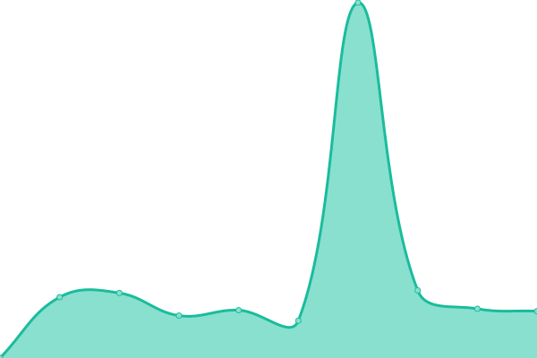
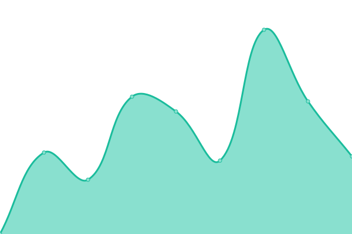
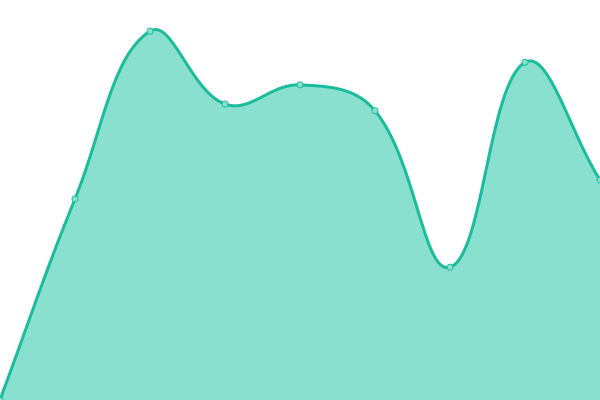

# [📈 Live Status](https://vanyakosmos.github.io/zakaz-uptime): <!--live status--> **🟧 Partial outage**

This repository contains the open-source uptime monitor and status page for [Bachynin Ivan](t.me/vanyakosmos), powered by [Upptime](https://github.com/upptime/upptime).

With [Upptime](https://upptime.js.org), you can get your own unlimited and free uptime monitor and status page, powered entirely by a GitHub repository. We use [Issues](https://github.com/vanyakosmos/zakaz-uptime/issues) as incident reports, [Actions](https://github.com/vanyakosmos/zakaz-uptime/actions) as uptime monitors, and [Pages](https://vanyakosmos.github.io/zakaz-uptime) for the status page.

<!--start: status pages-->
<!-- This summary is generated by Upptime (https://github.com/upptime/upptime) -->
<!-- Do not edit this manually, your changes will be overwritten -->
<!-- prettier-ignore -->
| URL | Status | History | Response Time | Uptime |
| --- | ------ | ------- | ------------- | ------ |
|  [Main](https://zakaz.ua) | 🟩 Up | [main.yml](https://github.com/vanyakosmos/zakaz-uptime/commits/HEAD/history/main.yml) | 

 2866ms
     
 | 

<a href="https://vanyakosmos.github.io/zakaz-uptime/history/main">98.53%</a>
    

|  [Metro](https://metro.zakaz.ua) | 🟥 Down | [metro.yml](https://github.com/vanyakosmos/zakaz-uptime/commits/HEAD/history/metro.yml) | 

 1354ms
     
 | 

<a href="https://vanyakosmos.github.io/zakaz-uptime/history/metro">99.03%</a>
    

|  [Auchan](https://auchan.zakaz.ua) | 🟥 Down | [auchan.yml](https://github.com/vanyakosmos/zakaz-uptime/commits/HEAD/history/auchan.yml) | 

 1475ms
     
 | 

<a href="https://vanyakosmos.github.io/zakaz-uptime/history/auchan">99.05%</a>
    

|  [Novus](https://novus.zakaz.ua) | 🟩 Up | [novus.yml](https://github.com/vanyakosmos/zakaz-uptime/commits/HEAD/history/novus.yml) | 

 1549ms
     
 | 

<a href="https://vanyakosmos.github.io/zakaz-uptime/history/novus">99.09%</a>
    

|  [CityMarket](https://citymarket.zakaz.ua) | 🟩 Up | [city-market.yml](https://github.com/vanyakosmos/zakaz-uptime/commits/HEAD/history/city-market.yml) | 

 1176ms
     
 | 

<a href="https://vanyakosmos.github.io/zakaz-uptime/history/city-market">98.86%</a>
    

|  [Cosmos](https://cosmos.zakaz.ua) | 🟩 Up | [cosmos.yml](https://github.com/vanyakosmos/zakaz-uptime/commits/HEAD/history/cosmos.yml) | 

 2575ms
     
 | 

<a href="https://vanyakosmos.github.io/zakaz-uptime/history/cosmos">98.90%</a>
    

|  [Ekomarket](https://ekomarket.zakaz.ua) | 🟩 Up | [ekomarket.yml](https://github.com/vanyakosmos/zakaz-uptime/commits/HEAD/history/ekomarket.yml) | 

 1982ms
     
 | 

<a href="https://vanyakosmos.github.io/zakaz-uptime/history/ekomarket">98.52%</a>
    

|  [Megamarket](https://megamarket.zakaz.ua) | 🟩 Up | [megamarket.yml](https://github.com/vanyakosmos/zakaz-uptime/commits/HEAD/history/megamarket.yml) | 

 2791ms
     
 | 

<a href="https://vanyakosmos.github.io/zakaz-uptime/history/megamarket">98.80%</a>
    

|  [Pchelka](https://pchelka.zakaz.ua) | 🟩 Up | [pchelka.yml](https://github.com/vanyakosmos/zakaz-uptime/commits/HEAD/history/pchelka.yml) | 

 782ms
     
 | 

<a href="https://vanyakosmos.github.io/zakaz-uptime/history/pchelka">98.55%</a>
    

|  [Stolychiy](https://stolychyi.zakaz.ua) | 🟩 Up | [stolychiy.yml](https://github.com/vanyakosmos/zakaz-uptime/commits/HEAD/history/stolychiy.yml) | 

 2107ms
     
 | 

<a href="https://vanyakosmos.github.io/zakaz-uptime/history/stolychiy">98.57%</a>
    

|  [Tavria V](https://tavriav.zakaz.ua) | 🟩 Up | [tavria-v.yml](https://github.com/vanyakosmos/zakaz-uptime/commits/HEAD/history/tavria-v.yml) | 

 1725ms
     
 | 

<a href="https://vanyakosmos.github.io/zakaz-uptime/history/tavria-v">98.81%</a>
    

|  [UltraMarket](https://ultramarket.zakaz.ua) | 🟩 Up | [ultra-market.yml](https://github.com/vanyakosmos/zakaz-uptime/commits/HEAD/history/ultra-market.yml) | 

 2153ms
     
 | 

<a href="https://vanyakosmos.github.io/zakaz-uptime/history/ultra-market">98.82%</a>
    

|  [Varus](https://varus.zakaz.ua) | 🟥 Down | [varus.yml](https://github.com/vanyakosmos/zakaz-uptime/commits/HEAD/history/varus.yml) | 

 0ms
     
 | 

<a href="https://vanyakosmos.github.io/zakaz-uptime/history/varus">0.00%</a>
    

|  [Vostorg](https://vostorg.zakaz.ua) | 🟩 Up | [vostorg.yml](https://github.com/vanyakosmos/zakaz-uptime/commits/HEAD/history/vostorg.yml) | 

 1678ms
     
 | 

<a href="https://vanyakosmos.github.io/zakaz-uptime/history/vostorg">98.83%</a>
    

|  [Metro MD](https://metro.zakaz.md) | 🟩 Up | [metro-md.yml](https://github.com/vanyakosmos/zakaz-uptime/commits/HEAD/history/metro-md.yml) | 

 1581ms
     
 | 

<a href="https://vanyakosmos.github.io/zakaz-uptime/history/metro-md">100.00%</a>
    

|  [Stores API - UA](https://stores-api.zakaz.ua) | 🟩 Up | [stores-api-ua.yml](https://github.com/vanyakosmos/zakaz-uptime/commits/HEAD/history/stores-api-ua.yml) | 

 454ms
     
 | 

<a href="https://vanyakosmos.github.io/zakaz-uptime/history/stores-api-ua">98.85%</a>
    

|  [Stores API - MD](https://stores-api.zakaz.md) | 🟥 Down | [stores-api-md.yml](https://github.com/vanyakosmos/zakaz-uptime/commits/HEAD/history/stores-api-md.yml) | 

 161ms
     
 | 

<a href="https://vanyakosmos.github.io/zakaz-uptime/history/stores-api-md">0.00%</a>
    

|  [Stores API - TEST](https://stores-api.test.zakaz.ua) | 🟩 Up | [stores-api-test.yml](https://github.com/vanyakosmos/zakaz-uptime/commits/HEAD/history/stores-api-test.yml) | 

 473ms
     
 | 

<a href="https://vanyakosmos.github.io/zakaz-uptime/history/stores-api-test">100.00%</a>
    

<!--end: status pages-->

[**Visit our status website →**](https://vanyakosmos.github.io/zakaz-uptime)

## 📄 License

- Powered by: [Upptime](https://github.com/upptime/upptime)
- Code: [MIT](./LICENSE) © [Bachynin Ivan](t.me/vanyakosmos)
- Data in the `./history` directory: [Open Database License](https://opendatacommons.org/licenses/odbl/1-0/)
